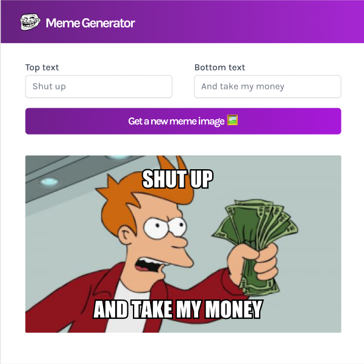

Meme Generator:  
The Meme Generator is a dynamic and entertaining web application designed to fetch trending meme images using API calls and empower users to personalize them with their unique thoughts. Built with React, the application incorporates key features such as event handlers for real-time text input, props for seamless data flow between components and state management for handling user interactions effectively.

Condition rendering ensures an engaging user experience by dynamically displaying selected meme templates and customized text overlays. This project combines creativity with interactivity, offering users a fun and intuitive platform to create and shares memes effortlessly.

